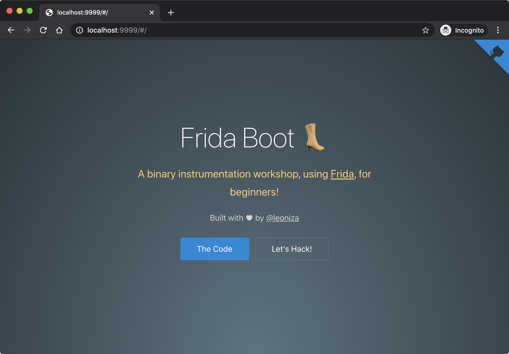

<h1 align="center">
  <br>
  <br>
  frida-boot 👢
  <br>
</h1>

<h4 align="center">A binary instrumentation workshop, using <a href="https://frida.re" target="_blank">Frida</a>, for beginners!</h4>



# Quickstart

- `git clone github.com/leonjza/frida-boot`
- `cd frida-boot`
- `./docker.sh pull`
- `docker.sh run`

After running the container, all of the workshop content will be available at <http://localhost:9999>.

## workshop slides

The latest slides for this workshop can be found on Google Slides [here](). A snaphot is availale in the <`slides/`> directory.

## manually building

The `Dockerfile` in this repository can be used to manually build the container. Feel free to edit it to suit your needs.

```bash
docker build -t frida-boot:local .
```
