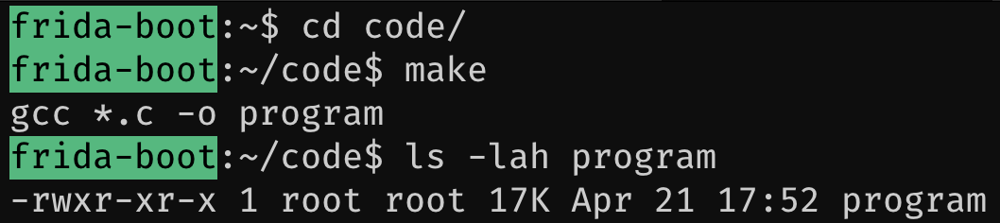

# Compiling the application

Having familirised ourselves with the source code a little, we can go ahead and compile the application in the container. Performing runtime instrumentation means we need to have a program that will run to instrument.

## Performing the compile

Inside of the docker container in the `/root/code` repository, compile the test program. A `Makefile` is provided that contains a default target to perform the compilation using `gcc`. Simple run `make` to compile the program.

```bash
~/code$ make
gcc *.c -o program
```

Of course, you could also manually invoke `gcc` if you wish, specifying any flags you want.

?> Take a look at the `Makefile` sources for other targets. For example, `make clean` will remove the compiled program.



Once the compilation is done, you should have a new ELF binary called `program` in the same folder. You can run it with `./program` now.

```bash
~/code$ ./program
(Wed Apr 22 19:02:31 2020) (tool) Please provide an iteration count
```

The program should complain that it wants an interation could, so to give it that run it again but this time with an argument like 10.

```bash
~/code$ ./program 10
(Wed Apr 22 19:03:22 2020) (tool) Running for 10 iterations
(Wed Apr 22 19:03:22 2020) (tool) Lets go!
(Wed Apr 22 19:03:22 2020) (tool) Waiting for: 5
```

If you want to exit the program before the interations complete, simply hit <kbd>&#8963;</kbd> + <kbd>c</kbd>.
