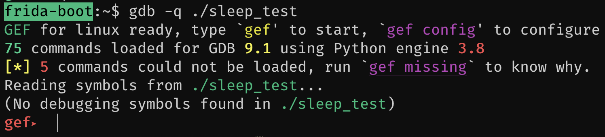
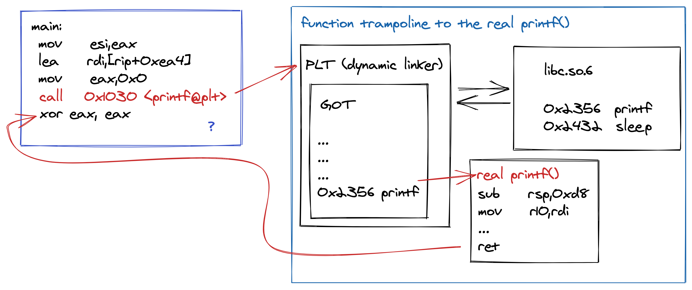
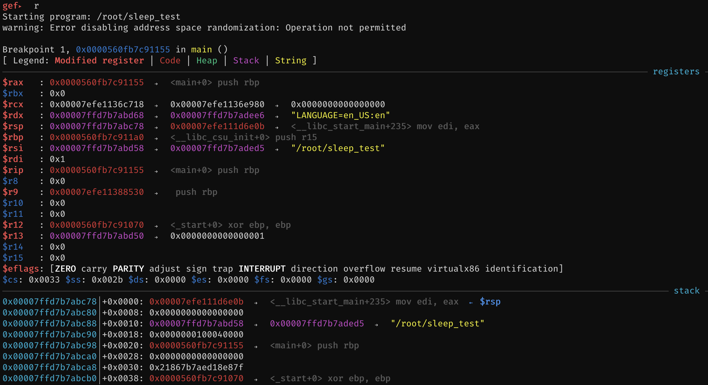
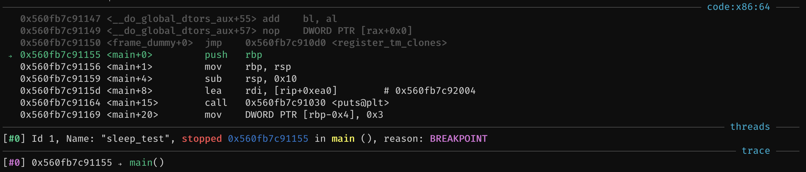
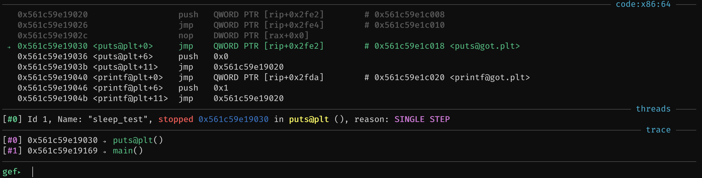
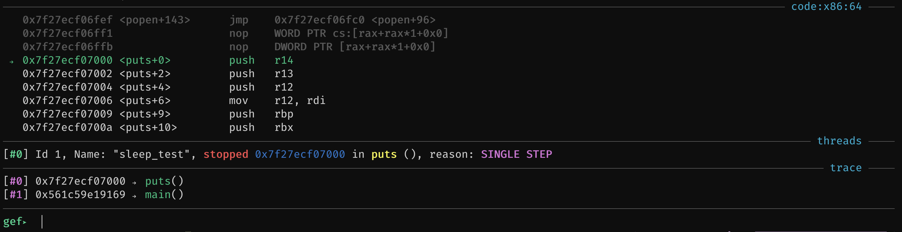
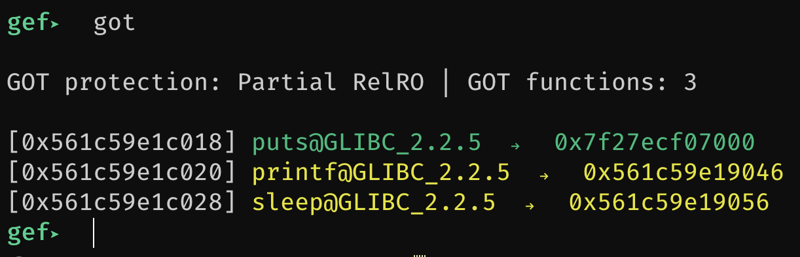
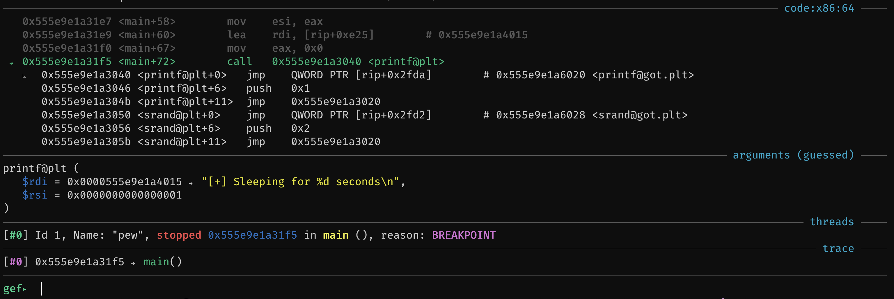
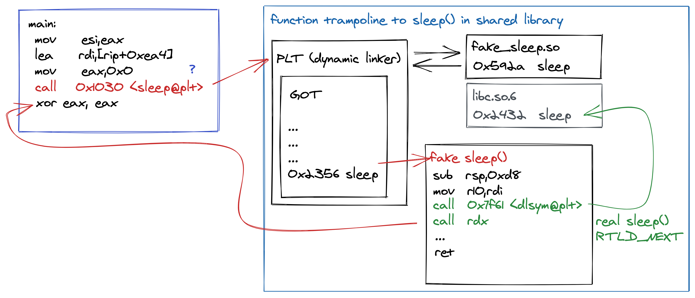

# Internals

So far we have seen how we can use `LD_PRELOAD` to hook the function call to `sleep()`. But what happens under the hood when we do this? To try and get a better view of the internals of this in preparation for playing with Frida, lets attach a debugger and step through the process of resolving a function.

## gdb quick start

The debugger we are going to use is the GNU Debugger, `gdb`. It's super popular and not too hard to use. Here are some basic commands we are going to use:

- `r` to "run" our program.
- `b` to set a "breakpoint".
- `s` to "step" a function.
- `si` to "step instruction".
- `info functions` to "list functions" in the binary.
- `info break` to list our breakpoints.
- `del <index>` to delete a breakpoint with the index obtained with `info break`.

To start the debugging session on our test binary called `pew`, simply run `gdb -q ./pew`. You should pre presented with a prompt, similar to this:

?> `-q` just silences some default banners.



Look at you! Already debugging! 🎉 To quit, just type `q` and hit enter.

## Enumerate the app

While we have the source code for this application (given that we wrote it), this will very rarely be the case. So, imagine for a moment you did not write the application you are debugging (or have the source code) and need to figure out what's inside the app.

### Using nm

Before we use the debugger again, let’s see how we can get an idea of which _symbols_ exists in the binary using the `nm` tool. Type `nm -D pew` and check the output:

```bash
$ nm -D pew
   w __cxa_finalize
   w __gmon_start__
   w _ITM_deregisterTMCloneTable
   w _ITM_registerTMCloneTable
   U __libc_start_main
   U printf
   U puts
   U rand
   U sleep
   U srand
   U time
```

Here we asked `nm` to dump the _Dynamic Symbol Table_ of the binary, which in our case translates to all of the functions that will be resolved at runtime. Try `nm` on some other programs like `bash`. `nm` expects a full path, so you can use something like `nm -D $(which bash)`.

```bash
$ nm -D $(which bash)
                 U abort
000000000003e500 T absolute_pathname
000000000003e560 T absolute_program
                 U access
0000000000079040 T add_alias
00000000000d4850 T add_history
00000000000d4790 T add_history_time

[... snip ...]
```

You will notice `bash` has many, many more symbols with a wide variety of flags a well! Lots of hooking opportunities :)

?> To learn more about what the flags like `U`/`T`/`w` etc. mean, check out `man nm`.

Symbols with the `U` flag mean "The symbol is undefined." (from `man nm`). This means that the dynamic linker will at runtime try and find the location for the function in any linked libraries (most often in libc) and use that function going forward.

### Using gdb

After opening our program in `gdb`, we could ask for the available function symbols there too. We can do this with `info functions`:

```text
gef➤  info functions
All defined functions:

Non-debugging symbols:
0x0000000000001000  _init
0x0000000000001030  puts@plt
0x0000000000001040  printf@plt
0x0000000000001050  srand@plt
0x0000000000001060  time@plt
0x0000000000001070  sleep@plt
0x0000000000001080  rand@plt
0x0000000000001090  __cxa_finalize@plt
0x00000000000010a0  _start
0x00000000000010d0  deregister_tm_clones
0x0000000000001100  register_tm_clones
0x0000000000001140  __do_global_dtors_aux
0x0000000000001180  frame_dummy
0x0000000000001185  rand_range
0x00000000000011ad  main
0x0000000000001210  __libc_csu_init
0x0000000000001270  __libc_csu_fini
0x0000000000001274  _fini
```

Great. We have a few symbols to work with. The first function we will be interested in would be `main()` which is effectively the entry point for our program. While it’s not the first code that gets executed when the program starts, for now just know that this is where the code we wrote starts. Next, we can see `printf@plt` and `sleep@plt`. Let's focus on these two for now.

When we used `nm` in the previous section, we saw that these symbols were marked as `U` (undefined). Within `gdb` however we get this `@plt` section. The Procedure Linkage Table (PLT) is essentially just a marker to tell the program that when we compiled the program, we did not know where `sleep` or `printf` was, and the dynamic linker should find those at runtime. The PLT is the entry point for that function resolution logic which will reference a section called the Global Offset Table (GOT) for addresses. The GOT is updated after the dynamic linker successfully resolved a functions' address the first time. Once resolved, the program will jump to the real `printf` and continue as normal. Next time the program wants to use `printf`, the offset in the GOT will be used.



Let's watch this in action using `gdb`

## debugging pew

Fire up `gdb`, specifying `pew` as the target to debug.

```bash
$ gdb -q ./pew
GEF for linux ready, type `gef' to start, `gef config' to configure
75 commands loaded for GDB 9.1 using Python engine 3.8
[*] 5 commands could not be loaded, run `gef missing` to know why.
Reading symbols from ./sleep_test...
(No debugging symbols found in ./sleep_test)
gef➤
```

Next, let's disassemble the `main` function and see what the machine code for it looks like.

```bash
gef➤  disas main
Dump of assembler code for function main:
   0x00000000000011ad <+0>: push   rbp
   0x00000000000011ae <+1>: mov    rbp,rsp
   0x00000000000011b1 <+4>: sub    rsp,0x10
   0x00000000000011b5 <+8>: lea    rdi,[rip+0xe48]        # 0x2004
   0x00000000000011bc <+15>: call   0x1030 <puts@plt>
   0x00000000000011c1 <+20>: mov    edi,0x0
   0x00000000000011c6 <+25>: call   0x1060 <time@plt>
   0x00000000000011cb <+30>: mov    edi,eax
   0x00000000000011cd <+32>: call   0x1050 <srand@plt>
   0x00000000000011d2 <+37>: mov    esi,0x5
   0x00000000000011d7 <+42>: mov    edi,0x1
   0x00000000000011dc <+47>: call   0x1185 <rand_range>
   0x00000000000011e1 <+52>: mov    DWORD PTR [rbp-0x4],eax
   0x00000000000011e4 <+55>: mov    eax,DWORD PTR [rbp-0x4]
   0x00000000000011e7 <+58>: mov    esi,eax
   0x00000000000011e9 <+60>: lea    rdi,[rip+0xe25]        # 0x2015
   0x00000000000011f0 <+67>: mov    eax,0x0
   0x00000000000011f5 <+72>: call   0x1040 <printf@plt>
   0x00000000000011fa <+77>: mov    eax,DWORD PTR [rbp-0x4]
   0x00000000000011fd <+80>: mov    edi,eax
   0x00000000000011ff <+82>: call   0x1070 <sleep@plt>
   0x0000000000001204 <+87>: jmp    0x11d2 <main+37>
End of assembler dump.
```

We don't have to dive into what the assembly actually means line by line. Instead, the lines containing a `call` to a function with the `@plt` suffix is of interest to us now.

```text
   0x00000000000011bc <+15>: call   0x1030 <puts@plt>
   0x00000000000011c6 <+25>: call   0x1060 <time@plt>
   0x00000000000011cd <+32>: call   0x1050 <srand@plt>
   0x00000000000011dc <+47>: call   0x1185 <rand_range>
   0x00000000000011f5 <+72>: call   0x1040 <printf@plt>
   0x00000000000011ff <+82>: call   0x1070 <sleep@plt>
```

?> Notice the call to `puts`. This is for the first line where we wrote the string "Starting up!", but because of compiler optimisations, the function got replaced to a `puts`.

Let's go ahead and put a breakpoint on the `main` function of our program. We can do this with:

```bash
gef➤  b *main
Breakpoint 1 at 0x11ad
```

You can see the list of breakpoints you have with `info br`.

```bash
gef➤  info br
Num     Type           Disp Enb Address            What
1       breakpoint     keep y   0x00000000000011ad <main>
```

If you wanted to, you could delete that breakpoint now with `del 1`.

Alright, next, we run the program with `r`. Hitting `r` and pressing enter should almost immediately hit our breakpoint as `main` is invoked quite early in the programs execution flow. It is a lot of information to digest, especially if this is the first time you are seeing this. Don't worry, we don't need to understand everything now ;)

The first parts of the output you will get when hitting a breakpoint is the CPU register and 'stack' region of memory.



Scrolling down towards the end of the output, we should see the _code_ and _trace_ sections. These are the only sections we are really going to be interested in. The _code_ section contains the instructions the CPU is going to perform. The _trace_ section is a dynamic view that tries and show context of the functions that have been called. For many reasons this view can be incorrect or have trouble showing accurate data, but its useful nonetheless.



The view you are looking at now can be retrieved at any time while a program is running by issuing the `context` command.

### libc function resolution

With our program paused at the start of the `main` function, let's step through the machine code and observe how libc functions gets resolved. We are not going to step through the entire process, but rather just watch how it does get resolved once, and not again.

To step to the next instruction in the `main` function, enter `si` (step instruction) in the debugger, and watch as the context is updated with instruction pointer moving from `push rbp` to `mov rbp, rsp`.

For example:

```bash
# code section
   0x555e9e1a31a9 <rand_range+36>  add    eax, edx
   0x555e9e1a31ab <rand_range+38>  leave
   0x555e9e1a31ac <rand_range+39>  ret
 → 0x555e9e1a31ad <main+0>         push   rbp
   0x555e9e1a31ae <main+1>         mov    rbp, rsp
   0x555e9e1a31b1 <main+4>         sub    rsp, 0x10
   0x555e9e1a31b5 <main+8>         lea    rdi, [rip+0xe48]        # 0x555e9e1a4004
   0x555e9e1a31bc <main+15>        call   0x555e9e1a3030 <puts@plt>
   0x555e9e1a31c1 <main+20>        mov    edi, 0x03
```

Type `si` and hit `enter`:

```bash
# code section
   0x555e9e1a31aa <rand_range+37>  ror    cl, 1
   0x555e9e1a31ac <rand_range+39>  ret
   0x555e9e1a31ad <main+0>         push   rbp
 → 0x555e9e1a31ae <main+1>         mov    rbp, rsp
   0x555e9e1a31b1 <main+4>         sub    rsp, 0x10
   0x555e9e1a31b5 <main+8>         lea    rdi, [rip+0xe48]        # 0x555e9e1a4004
   0x555e9e1a31bc <main+15>        call   0x555e9e1a3030 <puts@plt>
   0x555e9e1a31c1 <main+20>        mov    edi, 0x0
   0x555e9e1a31c6 <main+25>        call   0x555e9e1a3060 <time@plt>
```

Neat, you have stepped one instruction in the debugger. Many of the context views updated doing this, but again we are only really interested in the _code_ and _trace_ sections. Since we have not called any functions outside of `main`, the trace will currently just show that we are still in the `main()` function.

?> After entering `si` and hitting `enter`, the next time you hit `enter`, the last command (`si` in this case) will be run again.

Continue stepping until you enter the `puts@plt` function (that is after the `call <puts@plt>` was executed). This will be the case after a few `si` invocations and will eventually look like this:



At this point you should see that the _trace_ section now has two entries; `#0 puts@plt()` -> `#1 main()`. This means we are in the `puts@plt` function, called from the `main()` function.

We are not really interested in `puts` right now (even though the same thing as what is going to happen to `printf` is about to happen here), lets continue out of this function. Do so with a single run of the `s` (step) command.



Notice how the trace changed the current from `puts@plt` to `puts`. You are now in the _real_ `puts` function after the Dynamic Linker resolved it. One more time, step out of it with `s` so that we end up in main again right after the call to `puts@plt`.

```bash
   0x555e9e1a31b1 <main+4>         sub    rsp, 0x10
   0x555e9e1a31b5 <main+8>         lea    rdi, [rip+0xe48]        # 0x555e9e1a4004
   0x555e9e1a31bc <main+15>        call   0x555e9e1a3030 <puts@plt>
 → 0x555e9e1a31c1 <main+20>        mov    edi, 0x0
   0x555e9e1a31c6 <main+25>        call   0x555e9e1a3060 <time@plt>
   0x555e9e1a31cb <main+30>        mov    edi, eax
   0x555e9e1a31cd <main+32>        call   0x555e9e1a3050 <srand@plt>
   0x555e9e1a31d2 <main+37>        mov    esi, 0x5
   0x555e9e1a31d7 <main+42>        mov    edi, 0x1
```

#### the global offset table

At this stage it probably makes sense to have a look at the Global Offset Table (GOT) we have so far. The GOT should contain all of the resolved function addresses that have been through the dynamic linker. The `gdb` setup you have makes use of `gef` that has a pretty neat GOT status tool. Invoke it by running `got`.



The output shows us that `puts` has been resolved (in the green colour) and `printf` and `sleep` has not yet been resolved (yellow colour). While the colours are a nice indicator, the memory addresses for these functions also serve as a hint on the status. Running the `vmmmap` command should show you the memory ranges applicable to this program, and by checking the current address for the functions you can also deduce if they have been resolved yet.

```text
gef➤  vmmap
[ Legend:  Code | Heap | Stack ]
Start              End                Offset             Perm Path
0x0000555e9e1a2000 0x0000555e9e1a3000 0x0000000000000000 r-- /root/code/pew
[ ... ]
0x0000555e9efaf000 0x0000555e9efd0000 0x0000000000000000 rw- [heap]
0x00007fafbc51b000 0x00007fafbc540000 0x0000000000000000 r-- /lib/x86_64-linux-gnu/libc-2.30.soo
[ ... ]
```

You can also just run something like `info symbol 0x7fafbc591000` to get symbol information about a specific memory address.

```text
gef➤  info symbol 0x7fafbc591000
puts in section .text of /lib/x86_64-linux-gnu/libc.so.6
gef➤  info symbol 0x555e9e1a3046
printf@plt + 6 in section .plt of /root/code/pew
```

### following printf

Let's continue though `main` until we reach the `call printf@plt` instruction. There is quite a bit of code which could make stepping confusing, so instead, we can add another breakpoint on the location we are interested in. To do this, lets first disassemble the `main()` function, and then add the breakpoint on the location where `ptrintf()` is going to be called.

Get the disassembly for the `main()` function with `disas main`:

```text
gef➤  disas main
Dump of assembler code for function main:
   0x0000555e9e1a31ad <+0>: push   rbp
   0x0000555e9e1a31ae <+1>: mov    rbp,rsp
   0x0000555e9e1a31b1 <+4>: sub    rsp,0x10
   0x0000555e9e1a31b5 <+8>: lea    rdi,[rip+0xe48]        # 0x555e9e1a4004
   0x0000555e9e1a31bc <+15>: call   0x555e9e1a3030 <puts@plt>
   0x0000555e9e1a31c1 <+20>: mov    edi,0x0
   0x0000555e9e1a31c6 <+25>: call   0x555e9e1a3060 <time@plt>
   0x0000555e9e1a31cb <+30>: mov    edi,eax
   0x0000555e9e1a31cd <+32>: call   0x555e9e1a3050 <srand@plt>
   0x0000555e9e1a31d2 <+37>: mov    esi,0x5
   0x0000555e9e1a31d7 <+42>: mov    edi,0x1
   0x0000555e9e1a31dc <+47>: call   0x555e9e1a3185 <rand_range>
   0x0000555e9e1a31e1 <+52>: mov    DWORD PTR [rbp-0x4],eax
=> 0x0000555e9e1a31e4 <+55>: mov    eax,DWORD PTR [rbp-0x4]
   0x0000555e9e1a31e7 <+58>: mov    esi,eax
   0x0000555e9e1a31e9 <+60>: lea    rdi,[rip+0xe25]        # 0x555e9e1a4015
   0x0000555e9e1a31f0 <+67>: mov    eax,0x0
   0x0000555e9e1a31f5 <+72>: call   0x555e9e1a3040 <printf@plt>
   0x0000555e9e1a31fa <+77>: mov    eax,DWORD PTR [rbp-0x4]
   0x0000555e9e1a31fd <+80>: mov    edi,eax
   0x0000555e9e1a31ff <+82>: call   0x555e9e1a3070 <sleep@plt>
   0x0000555e9e1a3204 <+87>: jmp    0x555e9e1a31d2 <main+37>
End of assembler dump.
```

?> The `=>` character indicates the location of the instruction pointer which is the next instruction that will be executed if we continued through the program.

Next, we set a breakpoint on the line that shows `call   0x555e9e1a3040 <printf@plt>`. The address for this line for the current run of `pew` is `0x0000555e9e1a31f5`, so we set a breakpoint with `b *0x0000555e9e1a31f5`.

```text
gef➤  b *0x0000555e9e1a31f5
Breakpoint 2 at 0x555e9e1a31f5
```

That's it! We can now continue running the program with `c`, and watch as we hit the new breakpoint.



?> Notice the new "arguments (guessed)" section. This is something `gef` does for you to try and help debugging. It's pretty spot on in this case given that we gave `printf` a format string and the value `3`.

The very first instruction after the `call` is a jump to the GOT region with `jmp    QWORD PTR [rip+0x2fda]`. The next is to push `0x1` to the stack and then jump to another address. Stepping through this code you will notice the first jump to the GOT section is not taken. Instead, the `0x1` is pushed to the stack and the following jump _is_ taken.

This process is really the beginning of the Dynamic linker doing its thing. You can step quite a few instructions to get a feel for how complex this process really is. :D Just keep going with `si`. Even though `gef` shows a nice trace in the context output, you can ask `gdb` to generate you a back trace as well. Do this with `bt`.

```text
gef➤  bt
#0  0x00007fafbc6ee2e0 in ?? () from /lib64/ld-linux-x86-64.so.2
#1  0x00007fafbc6f2af3 in ?? () from /lib64/ld-linux-x86-64.so.2
#2  0x00007fafbc6f944a in ?? () from /lib64/ld-linux-x86-64.so.2
#3  0x0000555e9e1a31fa in main ()
gef➤
```

After running `si` a few times, you are probably going to be pretty deep into the dynamic linker doing its thing. We don't have to understand all of that, just that it’s a complex process. Let's return all the way back to `main` again. We can do this by entering the `finish` command which should break on return of the current function. Depending on how far you stepped, you may need to `finish` a few times before you will be back to `main` right after the call to `printf@plt`.

```text
# Code
   0x555e9e1a31e9 <main+60>        lea    rdi, [rip+0xe25]        # 0x555e9e1a4015
   0x555e9e1a31f0 <main+67>        mov    eax, 0x0
   0x555e9e1a31f5 <main+72>        call   0x555e9e1a3040 <printf@plt>
 → 0x555e9e1a31fa <main+77>        mov    eax, DWORD PTR [rbp-0x4]
   0x555e9e1a31fd <main+80>        mov    edi, eax
   0x555e9e1a31ff <main+82>        call   0x555e9e1a3070 <sleep@plt>
   0x555e9e1a3204 <main+87>        jmp    0x555e9e1a31d2 <main+37>
   0x555e9e1a3206                  nop    WORD PTR cs:[rax+rax*1+0x0]
   0x555e9e1a3210 <__libc_csu_init+0> push   r15]
# Trace
[#0] 0x555e9e1a31fa → main()
```

Given that our program is in the infinite loop at this stage with the call to jump back in the program (with `jmp    0x555e9e1a31d2 <main+37>`), lets continue with `c` so that we hit the breakpoint before `printf@plt` gets called again. Enter the `call` and step the instruction `jmp    QWORD PTR [rip+0x2fda]`. You should notice that this time we are immediately in the real `printf`. Pretty cool eh? The `got` command show now show that all of the libc calls we make are fully resolved.

## debugging pew with LD_PRELOAD

So far we have seen how the dynamic linker resolved libc functions (sort-of), storing the results in the GOT so that the next time the same function is called it knows where it is. How does that process look when we are using `LD_PRELOAD`?

Not much different to be honest. Let's take a look. We are going to start up a new debugging session for `pew` and like before, set a breakpoint on `main` too. However, before we run the program (with `r`), we are going to set the `LD_PRELOAD` environment variable within `gdb` first. Do this with `set environment LD_PRELOAD ./fake_sleep.so`. For example:

```text
gef➤  b *main
Breakpoint 1 at 0x1155
gef➤  set environment LD_PRELOAD ./fake_sleep.so
gef➤  r
```

After running the program and hitting the first breakpoint, you can inspect the current processes' environment variables with `show env`.

```bash
gef➤  show env
HOSTNAME=565eac426e0d

[ ... snip ... ]

LINES=39
COLUMNS=138
LD_PRELOAD=./fake_sleep.so
gef➤
```

Checking the processes virtual memory mapping should also show our extra shared library was loaded and is ready to use:

```bash
gef➤  vmmap fake_sleep
[ Legend:  Code | Heap | Stack ]
Start              End                Offset             Perm Path
0x00007f7115e60000 0x00007f7115e61000 0x0000000000000000 r-- /root/code/fake_sleep.so
0x00007f7115e61000 0x00007f7115e62000 0x0000000000001000 r-x /root/code/fake_sleep.so
0x00007f7115e62000 0x00007f7115e63000 0x0000000000002000 r-- /root/code/fake_sleep.so
0x00007f7115e63000 0x00007f7115e64000 0x0000000000002000 r-- /root/code/fake_sleep.so
0x00007f7115e64000 0x00007f7115e65000 0x0000000000003000 rw- /root/code/fake_sleep.so
```

We don't have to go through all of the detail again to see how the first time something like `printf` is called first invokes the dynamic linker. Instead, lets place a breakpoint at the end of the _while_ loop we have in the program, and inspect the GOT from there. With `gdb` paused at the breakpoint we set at `main`, lets disassemble the `main()` function again.

```bash
gef➤  disas main
Dump of assembler code for function main:
=> 0x000055b6bc0411ad <+0>: push   rbp
   0x000055b6bc0411ae <+1>: mov    rbp,rsp
   0x000055b6bc0411b1 <+4>: sub    rsp,0x10
   0x000055b6bc0411b5 <+8>: lea    rdi,[rip+0xe48]        # 0x55b6bc042004
   0x000055b6bc0411bc <+15>: call   0x55b6bc041030 <puts@plt>
   0x000055b6bc0411c1 <+20>: mov    edi,0x0
   0x000055b6bc0411c6 <+25>: call   0x55b6bc041060 <time@plt>
   0x000055b6bc0411cb <+30>: mov    edi,eax
   0x000055b6bc0411cd <+32>: call   0x55b6bc041050 <srand@plt>
   0x000055b6bc0411d2 <+37>: mov    esi,0x5
   0x000055b6bc0411d7 <+42>: mov    edi,0x1
   0x000055b6bc0411dc <+47>: call   0x55b6bc041185 <rand_range>
   0x000055b6bc0411e1 <+52>: mov    DWORD PTR [rbp-0x4],eax
   0x000055b6bc0411e4 <+55>: mov    eax,DWORD PTR [rbp-0x4]
   0x000055b6bc0411e7 <+58>: mov    esi,eax
   0x000055b6bc0411e9 <+60>: lea    rdi,[rip+0xe25]        # 0x55b6bc042015
   0x000055b6bc0411f0 <+67>: mov    eax,0x0
   0x000055b6bc0411f5 <+72>: call   0x55b6bc041040 <printf@plt>
   0x000055b6bc0411fa <+77>: mov    eax,DWORD PTR [rbp-0x4]
   0x000055b6bc0411fd <+80>: mov    edi,eax
   0x000055b6bc0411ff <+82>: call   0x55b6bc041070 <sleep@plt>
   0x000055b6bc041204 <+87>: jmp    0x55b6bc0411d2 <main+37>
End of assembler dump.
```

The instruction at the end of our while loop is the `jmp` call back to a position in `main`, which in my case was at `0x000055b6bc041204`. So, set a breakpoint on that address with `b *0x000055b6bc041204`.

!> Your address will probably be different, so update it with the correct location in the `b` command.

Next, we continue the program's execution with the `c` command.

```text
gef➤  c
Continuing.
[+] Starting up!
[+] Sleeping for 5 seconds
[-] sleep goes brrr

Breakpoint 2, 0x000055b6bc041204 in main ()
[ ... ]
```

At this point, we should be at the `jmp` instruction. Entries in the GOT should also have all been resolved. Let's check out the GOT.

```bash
gef➤  got

GOT protection: Partial RelRO | GOT functions: 6

[0x55b6bc044018] puts@GLIBC_2.2.5  →  0x7f7115d0f000
[0x55b6bc044020] printf@GLIBC_2.2.5  →  0x7f7115cef440
[0x55b6bc044028] srand@GLIBC_2.2.5  →  0x7f7115cd79f0
[0x55b6bc044030] time@GLIBC_2.2.5  →  0x7ffea31fbee0
[0x55b6bc044038] sleep@GLIBC_2.2.5  →  0x7f7115e61115
[0x55b6bc044040] rand@GLIBC_2.2.5  →  0x7f7115cd80f0
```

In `gdb`, we can ask for information about symbols. We can do this with the `info symbol` command, which takes one argument. Let’s check out some values from the GOT to see where they are.

```bash
gef➤  info symbol puts
puts in section .text of /lib/x86_64-linux-gnu/libc.so.6

gef➤  info symbol rand
rand in section .text of /lib/x86_64-linux-gnu/libc.so.6

gef➤  info symbol sleep
sleep in section .text of ./fake_sleep.so
```

As you can see, all of the function's except for `sleep` correctly resolved to their `libc` locations. As mentioned in the [`LD_PRELOAD`](1-chapter-1/ld_preload) section, libraries in the `LD_PRELOAD` environment variable get preference when the dynamic linker resolves functions. We just saw that happen!

### using the real sleep

One last thing. Remember the code we wrote to call `dlsym` to get the real address of `sleep` (hopefully in libc)? Let's see what that looks like as well. You know, while we have been getting super comfortable with a debugger :)

From the output of the `got` command, we could see that `sleep` resolved to an address that lives in our `fake_sleep.so` shared library. We can ask `gdb` to disassemble that function so that we can see what it's machine code looks like. For example:

```bash
gef➤  got

GOT protection: Partial RelRO | GOT functions: 6

[0x55b6bc044018] puts@GLIBC_2.2.5  →  0x7f7115d0f000
[0x55b6bc044020] printf@GLIBC_2.2.5  →  0x7f7115cef440
[0x55b6bc044028] srand@GLIBC_2.2.5  →  0x7f7115cd79f0
[0x55b6bc044030] time@GLIBC_2.2.5  →  0x7ffea31fbee0
[0x55b6bc044038] sleep@GLIBC_2.2.5  →  0x7f7115e61115
[0x55b6bc044040] rand@GLIBC_2.2.5  →  0x7f7115cd80f0

# we got sleep @ 0x7f7115e61115
gef➤  disas 0x7f7115e61115
Dump of assembler code for function sleep:
   0x00007f7115e61115 <+0>: push   rbp
   0x00007f7115e61116 <+1>: mov    rbp,rsp
   0x00007f7115e61119 <+4>: sub    rsp,0x20
   0x00007f7115e6111d <+8>: mov    DWORD PTR [rbp-0x14],edi
   0x00007f7115e61120 <+11>: lea    rdi,[rip+0xed9]        # 0x7f7115e62000
   0x00007f7115e61127 <+18>: call   0x7f7115e61030 <puts@plt>
   0x00007f7115e6112c <+23>: mov    DWORD PTR [rbp-0x14],0x1
   0x00007f7115e61133 <+30>: lea    rsi,[rip+0xeda]        # 0x7f7115e62014
   0x00007f7115e6113a <+37>: mov    rdi,0xffffffffffffffff
   0x00007f7115e61141 <+44>: call   0x7f7115e61040 <dlsym@plt>
   0x00007f7115e61146 <+49>: mov    QWORD PTR [rbp-0x8],rax
   0x00007f7115e6114a <+53>: mov    eax,DWORD PTR [rbp-0x14]
   0x00007f7115e6114d <+56>: mov    rdx,QWORD PTR [rbp-0x8]
   0x00007f7115e61151 <+60>: mov    edi,eax
   0x00007f7115e61153 <+62>: call   rdx   # <--------
   0x00007f7115e61155 <+64>: leave
   0x00007f7115e61156 <+65>: ret
End of assembler dump.
gef➤
```

?> You can also just run `disas sleep` here, `gdb` will resolve the function in the background for you.

Again, we don't have to know an awful lot about what all of this assembly means. The parts we are interested in are usually the `call` commands, and here we can see there is an instruction that says `call rdx`. So, whatever value is in the `RDX` register, this code will make a call to that.

To watch that happen, lets add another breakpoint on this instruction. I will do it with `b *0x00007f7115e61153`, but you need to use the address you have for the same instruction. Remember you can check the breakpoints you have with `info br`.

```bash
gef➤  info br
Num     Type           Disp Enb Address            What
1       breakpoint     keep y   0x000055b6bc0411ad <main>
   breakpoint already hit 1 time
2       breakpoint     keep y   0x000055b6bc041204 <main+87>
   breakpoint already hit 1 time
3       breakpoint     keep y   0x00007f7115e61153 <sleep+62>
```

With our breakpoint set, we can continue the execution of the program with `c`. This time round, the program should stop right before the `call rdx` instruction is executed.

```bash
# Code section
   0x7f7115e6114a <sleep+53>       mov    eax, DWORD PTR [rbp-0x14]
   0x7f7115e6114d <sleep+56>       mov    rdx, QWORD PTR [rbp-0x8]
   0x7f7115e61151 <sleep+60>       mov    edi, eax
 → 0x7f7115e61153 <sleep+62>       call   rdx
   0x7f7115e61155 <sleep+64>       leave
   0x7f7115e61156 <sleep+65>       ret
   0x7f7115e61157                  add    BYTE PTR [rax-0x7d], cl
   0x7f7115e6115a <_fini+2>        in     al, dx
   0x7f7115e6115b <_fini+3>        or     BYTE PTR [rax-0x7d], cl
```

We can inspect that value of the `RDX` register from the context view `gef` gives us here, or, we can dump it with `x $rdx`.

```bash
gef➤  x $rdx
0x7f7115d63d60 <sleep>: 0x83485355
```

In my case, `RDX` contained the value `0x7f7115d63d60`. Using the `info symbol` command, we can see where that points to. You can use either the address that you just revealed in `RDX` as an argument, or dynamically refer to it with the `$rdx` variable.

```bash
gef➤  info symbol 0x7f7115d63d60
sleep in section .text of /lib/x86_64-linux-gnu/libc.so.6
```

The real address for `sleep` in libc!

## summary

In the last example, what you hopefully took from that was that with our own shared library combined with `LD_PRELOAD`, we made the dynamic linker resolve *our* `sleep` function instead of the one available in libc. Then, inside of our own `sleep`, we used `dlsym` to resolve the real `sleep` function in libc.


