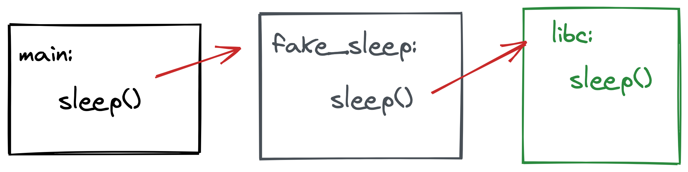

# LD_PRELOAD

Before we get our hands dirty with Frida, let's take a detour implement some hooking ourselves. We will do this by making use of the Linux `LD_PRELOAD` environment variable. From `man ld.so` we can read about this variable (and its many, many friends):

```text
LD_PRELOAD
    A list of additional, user-specified, ELF shared objects to be loaded  
    before all others. This feature can be used to selectively override  
    functions in other shared objects.
```

Basically, what that means is that we can build our own shared library and specify it with the `LD_PRELOAD` environment variable to be loaded when our program starts up. Our shared object can contain a function that already exists in another shared object, but our function will get preference when called.

Under the hood, when a call to something like `printf` is made for the first time, the C standard library actually dynamically resolves the address of where the code for `printf` really lives. It is possible to avoid this behaviour by compiling an executable with the `-static` flag, meaning all of the logic will be contained in the executable without any external dependencies. The `ldd` tool can be used to see which libraries an executable depends on.

```bash
# Dynamic executable
$ gcc *.c -o pew
$ ldd pew
    linux-vdso.so.1 (0x00007fff904a2000)
    libc.so.6 => /lib/x86_64-linux-gnu/libc.so.6 (0x00007fd35b18e000)
    /lib64/ld-linux-x86-64.so.2 (0x00007fd35b35c000)

# Static executable
$ gcc *.c -static -o pew # note the -static flag
$ ldd pew
    not a dynamic executable
```

When a dynamic executable encounters a function like `printf` for the first time, the libraries in the output of `ldd` will be searched for a function with that name. When we specify the `LD_PRELOAD` variable, we add a new library to that list that will be searched _before_ those in the list shown with `ldd`. Pretty cool eh.

## Exercise

Let's see this in action. Our `pew` program already makes use of functions from the libc shared library. Those functions are ones like `printf` and `sleep`.

```c
int main() {

    printf("[+] Starting up!\n");

    // ... snip
    while(1) {
        d = rand_range(1, 5);

        printf("[+] Sleeping for %d seconds\n", d);
        sleep(d);
    }
}
```

Compiling and running the `pew` program now means an infinite loop would be started, sleeping for a random number of seconds between `1` and `5`.

## sleeps arguments

If you were to write `pew.c` yourself, at some stage you may wonder which headers to use, and which arguments a function like sleep uses. For this information you can have a look at section 3 of the target functions manual page. i.e. `man 3 sleep`.

```text
SLEEP(3)    Linux Programmer's Manual   SLEEP(3)

NAME
       sleep - sleep for a specified number of seconds

SYNOPSIS
       #include <unistd.h>

       unsigned int sleep(unsigned int seconds);

DESCRIPTION
       sleep() causes the calling thread to sleep either until the number of real-time seconds specified in seconds have elapsed or until a signal arrives which is not ignored.
```

?> The `3` refers to the manual page section we want. Section 3 is typically for library functions from the C standard library.

The `SYNOPSIS` section tells us exactly which headers to include in our program, and what the function signature for `sleep()` is.

But what if we wanted to override the number of seconds we sleep for? Well, our one option is to change the source code and make it whatever the new value should be. Then, recompile and test. Or, we can use a shared library with `LD_PRELOAD`.

Here comes the fun part! 🎉

## Shared libraries

The man page for `ld.so`, explaining the `LD_PRELOAD` environment variable says we need to use a shared library for this, so let’s build one ourselves. Using the man page in the previous section as reference, we need to implement _exactly_ the same function signature in our library. So, create a new file called `fake_sleep.c` and implement the new and improved `sleep()` function. For now, we will just print a string indicating that our sleep was called and not the one from libc! (_Hint:_ Get the function signature/heads from `man 3 printf`).

```c
#include <stdio.h>

// man 3 sleep
//  unsigned int sleep(unsigned int seconds);
unsigned int sleep(unsigned int seconds) {

    // you've never slept the well in your life!
    printf("[-] sleep goes brrr\n");
    return 0;
}
```

This shared library will effectively replace what `sleep()` is supposed to do and actually not sleep at all!

Compiling a shared library is a _little_ different to a normal program. This time round we need to give `gcc` some new flags indicating that we want Position Independent Code (PIC) and more specifically a `shared` library. With that in mind we can compile the shared library with:

```bash
gcc -fPIC -shared fake_sleep.c -o fake_sleep.so
```

?> *Note* The output file name ends with an `.so`. `LD_PRELOAD` will ignore files that do not end with that extension.

With our shared library implementing `sleep()` ready, its time to hook the real `sleep()`! Do that now with `LD_PRELOAD=./fake_sleep.so ./pew`.

?> By running `LD_PRELOAD=./lib.so ./program`, we are specifying the `LD_PRELOAD` value for this run only. You can change that to be for any program started in the current shell with `export LD_PRELOAD=./lib.so`. Alternatively, if you have a library you want to be preloaded with any program, you can add a line to `/etc/ld.so.preload` (which can be pretty dangerous!).

```text
$ LD_PRELOAD=./fake_sleep.so ./pew
[+] Starting up!
[+] Sleeping for 3 seconds
[-] sleep goes brrr
[+] Sleeping for 2 seconds
[-] sleep goes brrr
[+] Sleeping for 2 seconds
[-] sleep goes brrr
[+] Sleeping for 2 seconds
[-] sleep goes brrr
[+] Sleeping for 2 seconds

[...]
```

## Detours

You may not always want to completely replace a function though. Instead, you may want to just add some logging to a function call to sniff arguments for example, just like a detour on your way somewhere nice. In that case, we will need to update the shared library to actually call the _real_ sleep once we are done with what we want to do.

!> This is a bit of a more advanced topic. Don't stress if everything isn't perfectly clear.



With our shared library overriding the call to `sleep()`, we need to figure out where the real `sleep()` is if we want to make use of it. One way to do that is call `dlsym` to dynamically try and determine the address of a symbol (in our case the real `sleep()`). With the address, we can proceed to call the original `sleep()` directly, without relying on the linker to resolve it. So how do we call `dlsym()`? `man 3 dlsym`!

```text
DLSYM(3)    Linux Programmer's Manual   DLSYM(3)

NAME
       dlsym, dlvsym - obtain address of a symbol in a shared object or executable

SYNOPSIS
       #include <dlfcn.h>

       void *dlsym(void *handle, const char *symbol);
```

Seems simple enough but truthfully, it’s a bit more tricky than that and you are better off reading the larger man page to understand the intricacies of how `dlsym` works. For the purpose of this exercise though, it’s just important to know that a handle to the real function should be created, and that handle should be resolved with `dlsym`.

One last thing, lets update the sleep to just sleep for `1` second in the library, and not for the amount of time that is actually requests. With all that coming together, our `fake_sleep.c` detour should now look something like:

```c
#define _GNU_SOURCE

#include <stdio.h>
#include <dlfcn.h>

// man 3 sleep
//  unsigned int sleep(unsigned int seconds);
unsigned int sleep(unsigned int seconds) {

    // you've never slept the well in your life!
    printf("[-] sleep goes brrr\n");

    seconds = 1;

    unsigned int (*original_sleep)(unsigned int);
    original_sleep = dlsym(RTLD_NEXT, "sleep");

    return (original_sleep)(seconds);
}
```

We are almost there! The last step would be to recompile our shared library, but because we are going to lookup symbols at runtime, we should also link a dynamic linker, `libdl`. It's a mouthful I know, but all that means is you need to add the `-ldl` flag at the end of your `gcc` command. For example:

```bash
gcc -fPIC -shared fake_sleep.c -o fake_sleep.so -ldl
```

That's it! Run the program again with the `LD_PRELOAD` environment variable set and watch as the three second sleep becomes only one second, with a nice message.

```bash
$ LD_PRELOAD=./fake_sleep.so ./pew
[+] Starting up!
[+] Sleeping for 3 seconds
[-] sleep goes brrr
[+] Sleeping for 3 seconds
[-] sleep goes brrr

[ ... actually sleeps for 1 second ... ]
```

Neat! You have just build a shared library that creates a detour for the `sleep()` function, logging when its invoked and altering the time to sleep to `1` second. All without touching the source code of the original program.
