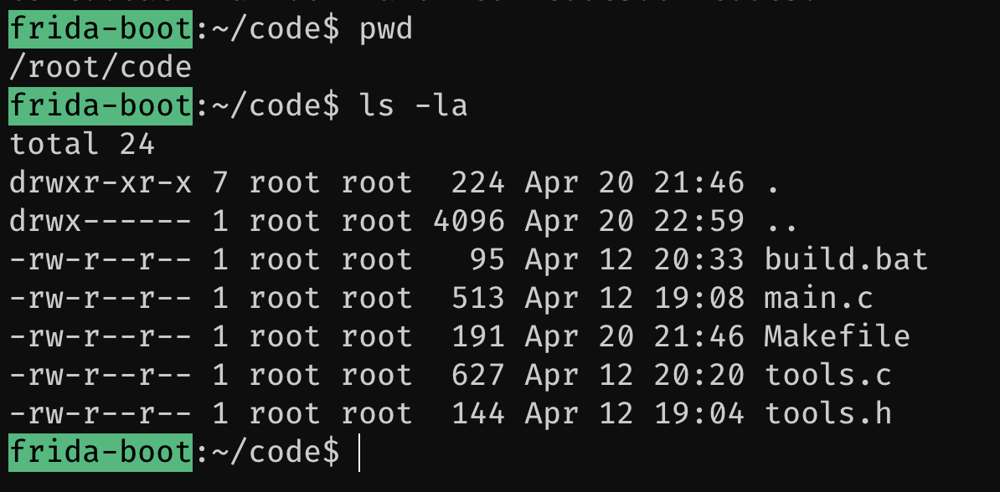

# The Sample Application

In the [`program/`](https://github.com/leonjza/frida-boot/tree/master/program) folder on your host lives a small, sample application that we will be experimenting with at first. This same folder should be available inside your container in the `/root/code` directory.



?> Take a moment to explore the source files a bit.

## Program structure

The sample program is atually really simple. The `main()` function takes a single argument and effectively loops for a random amount of seconds, for the number of iterations specified and prints a status line.

A simplified version of the `main()` function can be seen here.

```c
#include <stdio.h>
#include "tools.h"

int main(int argc, char **argv) {

    // ...

    while(iterations != 0) {
        wait_for_something_nice(1);
        iterations--;
    }

    // ...

    return 0;
}
```

A `tools.c` file contains some helper functions that the program uses, such as `random_int()` and `write_info_string()`. The function that is called in each iteration in the `main()` function is `wait_for_something_nice()` and looks something like this:

```c
#include <stdio.h>
#include <stdlib.h>
#include <time.h>
#include <string.h>

// ...

void wait_for_something_nice(int t) {

    t = t * random_int(1, 5);

    // ...

    sleep(t);

    // ...
}
```

Simple enough!
