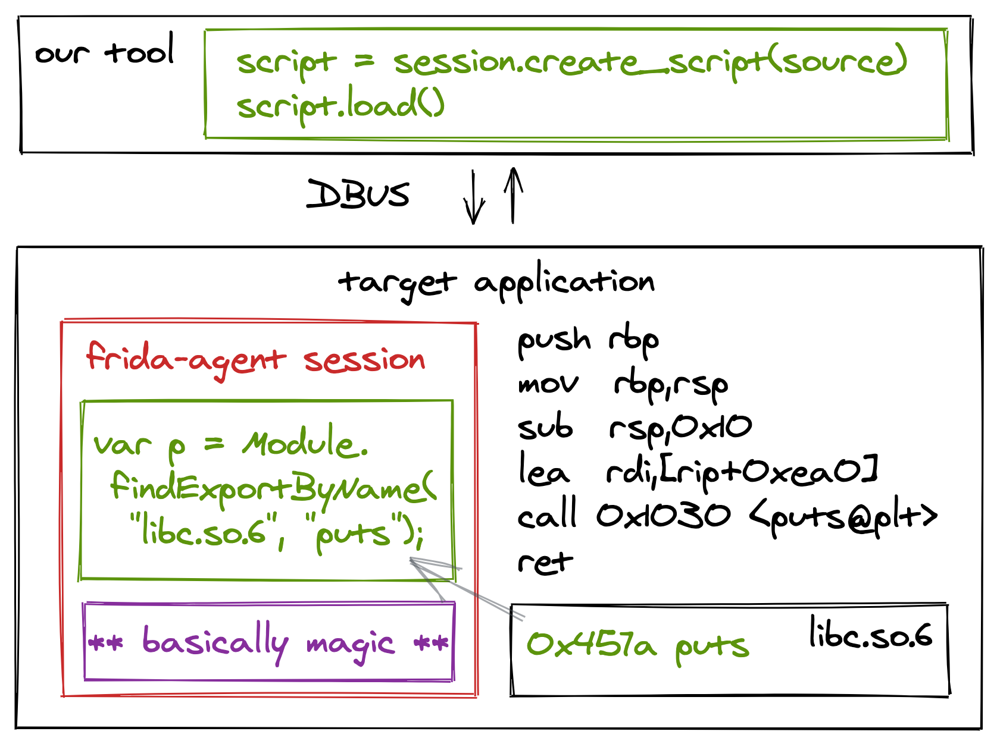

# Frida

Finally, the real reason you are here, right! Frida!

Using `LD_PRELOAD` is definitely an incredibly powerful debugging tool. However, I don't know about you but developing hooks in C does not sound too exciting to me. The feedback loop is also pretty long. Write code -> compile -> start target with `LD_PRELOAD` -> test. Repeat.

Frida is an alternative solution to this that I am sure is about to blow you away. So let's get into it.

## obligatory, what is frida

Imagine you could inject something like Google Chrome's JavaScript engine into a process, and perform all of the stuff we had just done using the `LD_PRELOAD` environment variable with small JavaScript snippets, all without stopping the target process.

With Frida, this is possible, developed primarily by the Wizard himself, [Ole André V. Ravnås](https://twitter.com/oleavr).


Today on the [frida.re](https://frida.re) website, the tool is described as:

> Dynamic instrumentation toolkit for developers, reverse-engineers, and security researchers.

A bit different to the first time I read it when it still said:

> Inject JavaScript to explore native apps on Windows, Mac, Linux and iOS.

I had no clue what that meant back then, but even today, both descriptions remain true.

We are not really going to dive into the internals of Frida itself. While I absolutely want to encourage you to do so (and to contribute to the project), that won't be necessary for now.

## frida components

The Frida project is pretty large, and there are many moving parts to it.

The first, and most important part is the Frida core, written in C. This component is responsible for injecting a JavaScript engine like V8 or Duktape into the target process and runs the JavaScript that you wrote in the target process.

The next component would be the Frida language bindings. It is possible to communicate with the Frida core using anyone one of the following languages; C, Python, Node Swift and .NET. For this workshop we will be using the Python bindings, but really you are free to choose whichever you prefer.

Next, there are language runtime bridges (or gum). These bridges make use of metadata rich runtimes such as Objective-C and Java on mobile devices that allows you to instrument these higher-level languages without the need to know the intricacies of the target runtimes themselves. While Objective-C and Java bridges are part of Frida, community bridges for runtimes like Swift and Mono (.NET) also exist.

Finally, there are a set of command line tools that make use of the Python bindings, available when you install the `frida-tool` pip package. The `frida-tools` package includes the base `frida` Read Evaluate Print Loop (REPL) tool, but also utilities such as `frida-ps`, `frida-trace` and `frida-discover`.

## modes of operation

Frida can operate in three primary modes:

- Injected (how were are going to use it most of the time)
- Embedded (basically a shared library that you can make part of a project)
- Preload (a combination of embedded mode with JavaScript already built to autonomously instrument applications)

## our usage of frida

The way we are going to use Frida in this workshop will be by using the Python bindings to inject scripts into programs to perform the instrumentation we want. The diagram below showcases an example where we enumerate where `puts` is. The parts in green are the ones we will be writing.

?> If this does not make sense yet, don't worry, we are going to do it all shortly! It's pretty easy.



A more elaborate diagram can be found [here](https://frida.re/docs/hacking/).

## example usage

Just running the `frida` command (remember, this is the Python `frida-tools` package) should give you an indication on how to use it.

```bash
$ frida
Usage: frida [options] target

frida: error: target file, process name or pid must be specified
```

?> Try running `frida --help` to get an idea of all of the flags and options available to you.

At this stage you have two options to launch Frida. You can either use Frida to spawn and attach to a target program, or inject into an already running program.

### frida spawn

To spawn and attach, simply run `frida ./pew` as an example:

```text
~/code$ frida ./pew
     ____
    / _  |   Frida 12.8.20 - A world-class dynamic instrumentation toolkit
   | (_| |
    > _  |   Commands:
   /_/ |_|       help      -> Displays the help system
   . . . .       object?   -> Display information about 'object'
   . . . .       exit/quit -> Exit
   . . . .
   . . . .   More info at https://www.frida.re/docs/home/
Spawned `./pew`. Use %resume to let the main thread start executing!
[Local::pew]->
```

That’s it! `pew` spawned, paused and now has Frida connected to it. Behind the scenes you just injected a JavaScript engine into the process too. l33t! 🎉 To resume `pew` to continue normal operations, just type `%resume` and hit `enter`. You should notice the sweet auto suggestions and tab completion there is too.

Normally the `frida` REPL can be used to quickly prototype small scripts and test things out. For example, in the REPL you can execute any valid JavaScript such as `console.log("poo");`, and the after pressing `enter`, that will get sent to the Frida agent running inside of the process and evaluated. Standard out should be sent back too, resulting in the word `poo` displaying in your shell.

To quit the REPL, simply hit `ctrl + d`. You may notice that `pew` is still running after you quit, and this is because quitting Frida simply means it detaches from the target process, not killing it. You should be able to see `pew` still running in the process list, and you can safely kill it with `kill -9 $(pidof pew)`.

### frida attach

Attaching to a running process is just as easy. For this you are going to need two shells in the docker container, so either spawn another or use `tmux`, whichever you prefer.

?> Refer to the [getting shells](0-getting-started/shells) section if you are unsure how to get another shell in the Docker environment.

Run the `pew` program in one shell so that it sleeps, printing its status along the way.

```bash
$ ./pew
[+] Starting up!
[+] Sleeping for 2 seconds
[+] Sleeping for 4 seconds
[+] Sleeping for 1 seconds
```

In a new shell, attach Frida to the process with `frida pew`. Note that we use the process name here, not the full path to the process signalled with a `./` in front of `pew`.

```text
$ frida pew
     ____
    / _  |   Frida 12.8.20 - A world-class dynamic instrumentation toolkit
   | (_| |
    > _  |   Commands:
   /_/ |_|       help      -> Displays the help system
   . . . .       object?   -> Display information about 'object'
   . . . .       exit/quit -> Exit
   . . . .
   . . . .   More info at https://www.frida.re/docs/home/

[Local::pew]->
```

This time round the process is not paused, but instead allowed to continue as normal with Frida attached. We are now ready to start instrumentation!
