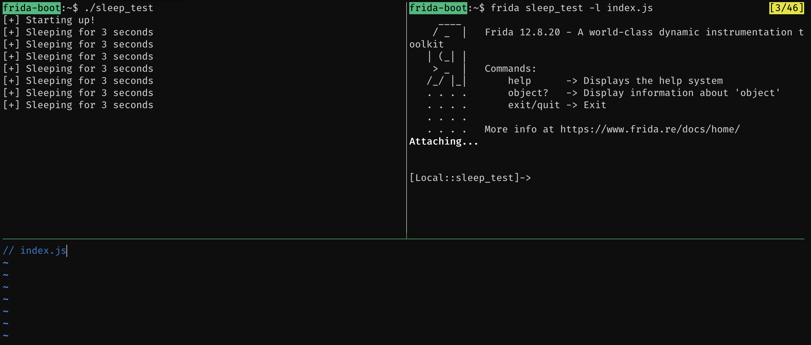
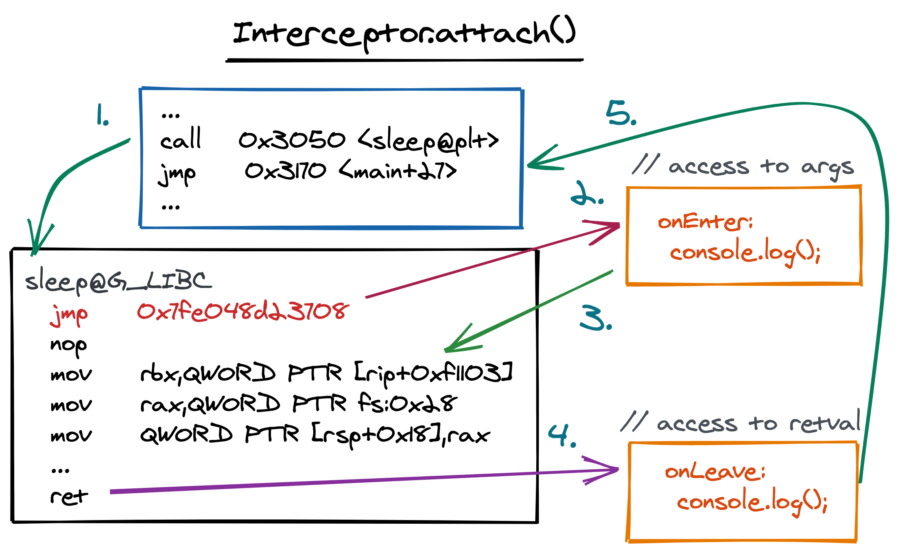

# sleep hook, v2

Let's replicate the instrumentation we did for the `sleep` function in the [previous section](1-chapter-1/ld_preload), but this time using Frida. Previously we were effectively just spying on the `sleep()` function, having a place to run some code before and after the real sleep was called.

We are going to concentrate on the JavaScript component for this. We will write a small JavaScript file that we will load using the `frida` tool and the `-l`/`--load` flag.

## setup

For this to work (and to demonstrate) we need three things. The target program, `sleep_test` in our case, to run. An empty JavaScript file, lets call it `index.js` and finally the `frida` tool booted to inject into `sleep_test`, loading the (empty for now) `index.js`. So:

- Run `sleep_test` in a shell.
- Run `touch index.js` in another shell.
- Run `frida sleep_test -l index.js` in a third shell.

With those three steps done, you want to leave the target program `sleep_test` and the `frida` tool running. All we need to do now is edit the `index.js` file.

I use `tmux`, so my environment at this stage would have 3 panes open at the moment.



## the index.js script

We will be referring to the Frida JavaScript API documetation a lot for this section. I highy reccomend you give it a thorough read through at some stage.

Using the `LD_PRELOAD` method, we replaced the real implementation of `sleep` with our own one by relying on some dynamic linker foolery. More specifically, given that libraries loaded with `LD_PRELOAD` get preference over other's, by just defining the same symbol as libc we got ours loaded thanks to library preference. This time round though, the application is already running. So how can we replace what `sleep` does?

I'll save you some reading for now and hint that we are interested in the `Interceptor` API here. More specifically, the `attach()` method on the `Interceptor` module. Remember that using the `LD_PRELOAD` we finally called the real `sleep()`. The program flow was directed to our custom `sleep()` implementation, but we in turn continued the flow to the real `sleep()`. Using the `Interceptor.attach()` method, we can achieve the same thing.

Take a moment and have a look at the [Interceptor](https://frida.re/docs/javascript-api/#interceptor) documentation now. `Interceptor.attach()` is described as:

```text
Interceptor.attach(target, callbacks[, data]):
    Intercept calls to function at target. This is a NativePointer specifying the address of the function you would like to intercept calls to.
```

We need to pass along a `NativePointer` as the first argument to `attach()`. Next, the callbacks for `attach()` are `onEnter` and `onLeave`. As the names say, `onEnter` will be called as soon as the _target_ function is entered, and `onLeave` will be called as the _target_ function is returned. The callbacks also have access to the original arguments and return value for the _target_ function. More on this later.

Practically our script would look something like this:

```javascript
Interceptor.attach(target, {
    onEnter: function(args) { },
    onLeave: function(retval) { }
});
```

Before we can go ahead and implement our script, the first piece to solve here is _target_. The documentation for `attach()` states that it wants a `NativePointer`, and reading the [documentation](https://frida.re/docs/javascript-api/#nativepointer) for a `NativePointer` we can see that we can create one from a string (such as `s`). ie: `new NativePointer(s)` / `ptr(s)`. However, `s` needs to be a hex value to construct the pointer from, and given that we are interested in `sleep()`, we can't just use any string.

## resolving sleep statically

Frida has a wide range of helper functions available to resolve symbols such as `sleep`. Before we dive into those, let's take a look at how we could manually determine the location for it.

The `nm` tool can be used to show the contents of symbol tables in binaries. Running it against the `sleep_test` binary should look something like this:

```text
$ nm sleep_test
0000000000004040 B __bss_start
0000000000004040 b completed.7452

[ ... ]

00000000000011a0 T __libc_csu_init
                 U __libc_start_main@@GLIBC_2.2.5
0000000000001155 T main
                 U printf@@GLIBC_2.2.5
                 U puts@@GLIBC_2.2.5
00000000000010d0 t register_tm_clones
                 U sleep@@GLIBC_2.2.5
[ ... ]
```

?> You can also use `readelf -Ws sleep_test` to display similar output, sometimes more readable than `nm`.

The output shows us that `sleep@@GLIB_C` has the `U` (undefined) flag, which should be resolved at runtime using the linker (making things like the `LD_PRELOAD` hack possile). The `G_LIBC` is a hint as to which library should have it. Alright, let's take a look at the shared libraries our binary depends on. This can be done with the `ldd` tool:

```text
$ ldd sleep_test
        linux-vdso.so.1 (0x00007ffd0feda000)
        libc.so.6 => /lib/x86_64-linux-gnu/libc.so.6 (0x00007f97e7599000)
        /lib64/ld-linux-x86-64.so.2 (0x00007f97e7767000)
```

?> Try running `ldd sleep_test` a few times. You should see the base address for the library change on every run. This is as a result of ASLR.

We know that the `sleep()` function we are targetting here is part of libc, so let's run `nm -D` on `libc.so.6`. The output will be very large (more than 2000 symbols), so lets filter for `sleep()` as well:

```text
$ nm -D /lib/x86_64-linux-gnu/libc-2.30.so | grep sleep
000000000010a390 T __clock_nanosleep
000000000010a390 W clock_nanosleep
00000000000cae50 T __nanosleep
00000000000cae50 W nanosleep
00000000000f35a0 T __nanosleep_nocancel
00000000000cad60 W sleep
0000000000084d40 T thrd_sleep
00000000000f5840 T usleep
```

?> We add the `-D` flag to check the dynamic symbols that will be available at runtime when using `libc`. By default, `nm` will read the `.symtab` section, which is usually stripped.

Neat, a weak symbol (`W` flag) to `sleep` at `0xcad60`. Unfortuantely that is not the value we will use for `s` when invoking `new NativePointer()` as the value is the relative address to the code in libc. Thanks to ASLR, this will be different everytime the program runs. Don't worry about it though, we can resolve these at runtime.

Let's verify that we got the address of `0xcad60` right using `gdb` quickly:

```text
$ gdb -q /lib/x86_64-linux-gnu/libc-2.30.so

[ ... ]

gef➤  info address sleep
Symbol "sleep" is at 0xcad60 in a file compiled without debugging.
```

In `gdb` we have the same addres for `sleep`. Neat! Now again, ASLR will make this address change everytime a binary is run, so let's see if using `0xcad60` as an offset for the function from libc's base address will get us at the same location.

To do this start `gdb` on the `sleep_test` binary again and set a breakpoint on the `main` function with `b *main`. Next, run the binary with `r` and the program should pause after hitting the breakpoint. At this point the shared libraries should all have been loaded. Next, have a look at the processes memory map with `info proc map` (or `vmmap`):

```text
gef➤  info proc map
process 610
Mapped address spaces:

          Start Addr           End Addr       Size     Offset objfile
      0x564e21bf2000     0x564e21bf3000     0x1000        0x0 /root/sleep_test
      0x564e21bf3000     0x564e21bf4000     0x1000     0x1000 /root/sleep_test
      0x564e21bf4000     0x564e21bf5000     0x1000     0x2000 /root/sleep_test
      0x564e21bf5000     0x564e21bf6000     0x1000     0x2000 /root/sleep_test
      0x564e21bf6000     0x564e21bf7000     0x1000     0x3000 /root/sleep_test
      0x7f69c4958000     0x7f69c497d000    0x25000        0x0 /lib/x86_64-linux-gnu/libc-2.30.so
      0x7f69c497d000     0x7f69c4ac7000   0x14a000    0x25000 /lib/x86_64-linux-gnu/libc-2.30.so

[ ... ]
```

?> You can see the same information for a process outside of `gdb` with `cat /proc/<pid>/maps`.

We can see libc's start address is `0x7f69c4958000` with a zero offset. So, lets see what is at `0x7f69c4958000` + `0xcad60`:

```text
gef➤  info symbol 0x7f69c4958000+0xcad60
sleep in section .text of /lib/x86_64-linux-gnu/libc.so.6
```

## resolving sleep with frida

Much like `gdb` is able to quickly resolve symbols to addresses, Frida can do this too. Depending on if your target has exported functions (or the symbol is exported), the way you will resolve the address dynamically with Frida will change.

Let's play with some of the Frida API's available to us to resolve addresses. Much like with `ldd` we can see which modules a program depends on, we can use the `Process.enumerateModulesSync()` function to get information about the modules loaded in the current process.

Try that now in your Frida REPL, attached to `sleep_test`.

```text
[Local::sleep_test]-> Process.enumerateModulesSync();
[
    {
        "base": "0x55d4c44d1000",
        "name": "sleep_test",
        "path": "/root/sleep_test",
        "size": 20480
    },
    {
        "base": "0x7fff98db2000",
        "name": "linux-vdso.so.1",
        "path": "linux-vdso.so.1",
        "size": 8192
    },
    {
        "base": "0x7f9a3e5bf000",
        "name": "libc-2.30.so",
        "path": "/lib/x86_64-linux-gnu/libc-2.30.so",
        "size": 1830912
    }

    [ ... ]
]
```

?> Many functions in the Frida API have syncronous and asyncronous versions. The one you use highly depends on the program you are writing. For example, `enumerateModules()` responds to callbacks as modules are discovered, whereas `enumerateModulesSync()` blocks until module resolution is complete, returning an array of discovered modules. Keep this in mind as you read the documentation and write your code!

The `enumerateModulesSync()` gave us an array of modules available in the target process. If we were interested in only a single module, we could use the `getModuleByName()` call. A variation of the same function exists called `getModuleByAddress()` which does exactly what you think it does. The return to `getModuleByName()` in the Frida world is a `Module` object.

Try getting libc now.

```text
[Local::sleep_test]-> Process.getModuleByName("libc-2.30.so");
{
    "base": "0x7f9a3e5bf000",
    "name": "libc-2.30.so",
    "path": "/lib/x86_64-linux-gnu/libc-2.30.so",
    "size": 1830912
}
```

!> A variation of the `getModuleByName()` function exists called `findModuleByName()` which will return `null` of the module could not be found. The `get*` variant will return an error if the target module is not found.

Now imagine we wanted to know which exports existed in libc. We can do that with the `Module.enumerateExports()` API where `Module` is the resolved module we already had in the previous step. Typically in a script you would do that as follows:

```javascript
var libc = Process.getModuleByName("libv-2.30.so");
var exports = libc.enumerateExports();

console.log(exports);   // print results
```

In our case, we are just going to do it in one line by calling `enumerateExports()` after we called `getModuleByName()`. Do that now.

```text
[Local::sleep_test]-> Process.getModuleByName("libc-2.30.so").enumerateExports();
[
    [ ... ]

    {
        "address": "0x7f9a3e6b8ec0",
        "name": "vwarn",
        "type": "function"
    },
    {
        "address": "0x7f9a3e6b1340",
        "name": "fts64_close",
        "type": "function"
    },

    [ ... ]
]
```

The return fo that should be a pretty large list! Thankfully we could use JavaScript to filter the results down using the `filter()` function on the array that `enumerateExports()` returns.

```text
[Local::sleep_test]-> Process.getModuleByName("libc-2.30.so").enumerateExports().filter(function(n) { return n.name == "sleep"; } );
[
    {
        "address": "0x7f9a3e689d60",
        "name": "sleep",
        "type": "function"
    }
]
```

As a pretty printed script, that would have looked as follows:

```javascript
Process.getModuleByName("libc-2.30.so")
    .enumerateExports()
        .filter(function(n) {
            return n.name == "sleep";
        });
```

Amazing! The `.address` property in that response is exactly what we need to create a valid `NativePointer` for `attach()`! Go ahead and attach `gdb` to the process and confirm it with `info address sleep`!

That was quite a few API calls to make to get the address of sleep though. There is a simple way, and we are going to use that now. Take a look at `Module.getExportByName()`. The function has the following signature from the documentation:

```text
Module.getExportByName(moduleName|null, exportName)
```

`getExportByName` takes two arguments where `moduleName` is the module name as per `Process.enumerateModules()` and `exportName` would be the name of the function we are interested in; `sleep` in our case. Notice how `moduleName` could be `null` as well. Passing `null` here signals Frida to look for the symbol in *any* module, and depending on if you use `getExportByName()` or `findExportByName()`, you may be presented with more than one result of more than one function by that name is found.

Let's use the simplified API now to resolve the address of `sleep()` at runtime.

```javascript
// Passing null for the module
[Local::sleep_test]-> Module.getExportByName(null, "sleep");
"0x7f9a3e689d60"

// Explicitly specifying the module name
[Local::sleep_test]-> Module.getExportByName("libc-2.30.so", "sleep");
"0x7f9a3e689d60"
[Local::sleep_test]->
```

A little simpler than the previous run, and gets us that address we need! 🎉

## attaching to sleep

We know enough now to be dangerous! Let's return to that `index.js` file and write the code to attach to the `sleep()` function. To recap, we need to resolve the address of `sleep()`, create a `NativePointer` and pass the result to `Interceptor.attach()`.

Give that a try.

```javascript
var sleep = Module.getExportByName(null, "sleep");

Interceptor.attach(sleep, {
    onEnter: function(args) {
        console.log("[*] Sleep from Frida!");
    },
    onLeave: function(retval) {
        console.log("[*] Done sleeping from Frida!");
    }
});
```

With that saved to the `index.js` file, loaded with the Frida command line tool, you should start seeing output as follows in the REPL:

```text
[Local::sleep_test]-> [*] Sleep from Frida!
[*] Done sleeping from Frida!
[*] Sleep from Frida!
[*] Done sleeping from Frida!
```

Woa, you just instrumented your first application using Frida! Pretty easy huh?

## attach under the hood

If we were to check what the `sleep()` function looked like before and after Frida was attached, we would see the following differences to the to the prolouge of the function.

Before Frida:

```text
gef➤  disas sleep
Dump of assembler code for function sleep:
   0x00007fe04b024d60 <+0>:     push   rbp
   0x00007fe04b024d61 <+1>:     push   rbx
   0x00007fe04b024d62 <+2>:     sub    rsp,0x28
   0x00007fe04b024d66 <+6>:     mov    rbx,QWORD PTR [rip+0xf1103]
   0x00007fe04b024d6d <+13>:    mov    rax,QWORD PTR fs:0x28
   0x00007fe04b024d76 <+22>:    mov    QWORD PTR [rsp+0x18],rax
   0x00007fe04b024d7b <+27>:    xor    eax,eax

[ ... ]
```

After running `Interceptor.attach()`, we should see the prologue modified with a new `jmp` instruction:

```text
gef➤  disas sleep
Dump of assembler code for function sleep:
   0x00007fe04b024d60 <+0>:     jmp    0x7fe048d23708
   0x00007fe04b024d65 <+5>:     nop
   0x00007fe04b024d66 <+6>:     mov    rbx,QWORD PTR [rip+0xf1103]
   0x00007fe04b024d6d <+13>:    mov    rax,QWORD PTR fs:0x28
   0x00007fe04b024d76 <+22>:    mov    QWORD PTR [rsp+0x18],rax
   0x00007fe04b024d7b <+27>:    xor    eax,eax

[ ... ]
```

If we were to picture the code flow when we use `Interceptor.attach()` on `sleep()`, consider the following diagram. At _1_, a call to `sleep()` is made. At this point the dynamic linker has already resolved the address for it, so the real `sleep()` gets called. Once inside `sleep()`, the first instruction for the function is to `jmp` to an arbitrary address (and not the normal function prologue) which is a result of Frida. So, at _2_ we effectively enter the Frida world, which eventually will call the `onEnter` function we defined. In our case, we are just logging that we entered the function. Next, at _3_, the real `sleep()` is called, doing whatever it should do. Finally, when we `ret` from `sleep()`, control is passed back to Frida because we defined an `onLeave` function. If you omit this callback, the function would have returned back to the instruction after the caller. Finally, when all of that is done, control is passed back to the original caller at _5_.


