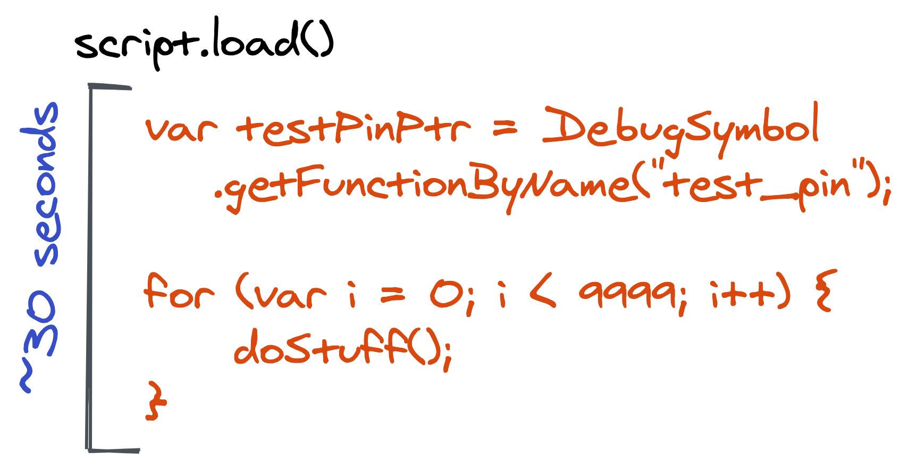

# lifecycle

You may have noticed the line `sys.stdin.read()` we used in the previous examples. This is actually just a small hack to keep the Python program alive. Depending on what your script does, you may not need this. Before we understand why, let’s take a closer look at the lifecycle of loading a script.

## load timeout

The PIN brute forcer we have implemented finished relatively quickly, and is implemented by reusing the target program's logic. When you make a call to `script.load()`, the sript you have provided in the `create_script()` call is sent to the Frida agent in the process and evaluated. Frida gives this the call to `script.load()` about 30 seconds to complete. If it took longer than that, Frida would raise an exception stating that a timeout was reached.



Once loaded, the `script` object on the Python side of things can remain alive for a long time. Technically speaking, we can remove the `sys.stdin.read()` line and our script will work just fine. That is because we are sort of abusing the initialisation phase of the script which completes pretty fast. For longer living instrumentation though, this will be necessary.

The PIN brute forcer we have going here is just us reusing the target programs code for other purposes. That is not the only type of instrumentation you may want to do though. Instead, what if you used something like `Interceptor.attach()`? In that case, without the `sys.stdin.read()` line, the `Interceptor.attach()` may attach, but because the Python program exists shortly after the `script.load()` call (without the `sys.stdin.read()` line), everything is undone.

Give it try now. Attach to the `atoi` function in your agent, and remove the `sys.stdin.read()` line. Your JavaScript may look something like this:

```javascript
var atoi = Module.getExportByName(null, "atoi");

Interceptor.attach(atoi, {
    onEnter: function(args) {
        console.log("in atoi!");
    }
});
```

Without the `sys.stdin.read()` line, the script will exit and the instrumentation would do nothing. Not ideal :P

```text
~/code$ tail tool.py
    print(message)

session = frida.attach("crypt")
script = session.create_script(agent)
script.on("message", incoming)
script.load()

# block so that the program does not quit.
#sys.stdin.read()

~/code$ python3 tool.py
```

Now, there are hacks around this (like the one you are already seeing) as well as other async JavaScript invocations. Instead of those, let's take a look at another way, using the Frida RPC interface.
