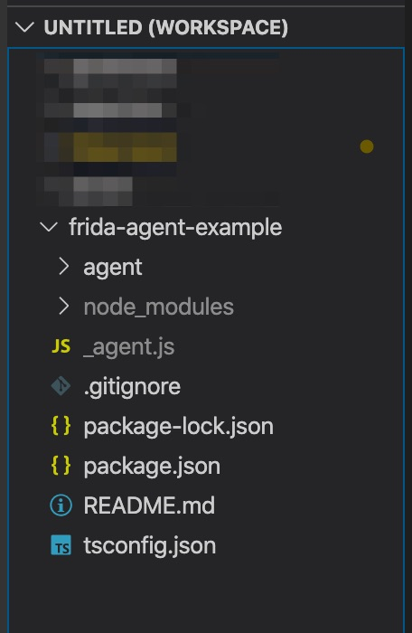
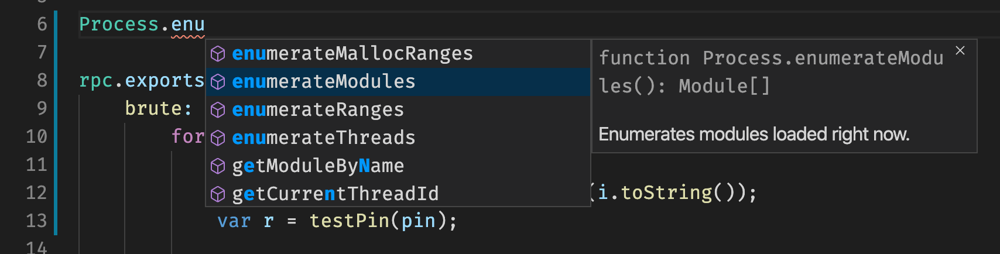

# typescript

Frida has official TypeScript [types](https://github.com/DefinitelyTyped/DefinitelyTyped/tree/master/types/frida-gum), which when combined with [VSCode](https://code.visualstudio.com/) make for an incredibly neat development experience.

The documentation website will always serve as a quick reference for how to use Frida modules, or, simply as a place to discover the myriad of crazy things it can do. However, when using TypeScript you may never have to refer to them again. Instead, the documentation would live right inside your editor.

## typescript intro for us mere mortals

Don't be scared when you read about TypeScript. The JavaScript syntax you know today is also valid TypeScript. The difference is that TypeScript offers extra, optional syntax sugar that turns JavaScript in to a typed langauge. That means, instead of you realising at runtime you are using the wrong object type, TypeScript will give you the error that that will happen before you run!

The other really great thing this offers is is the ability to use any package availble in the nodejs ecosystem in your agent! That means you can do crazy things like embed a webserver into your target process. Aditionally, you can make use of the latest and greatest JavaScript syntax (like ES6), and easily transpile it for runtimes that do not support that (like Duktape).

As far as "what is the minimum amount of things I need to know to use it" goes, it's really just two things.

1. You need to transpile your TypeScript to JavaScript. That means there is a process that needs to run to take the TypeScript you have written and translate it into the JavaScript version of your choosing.
2. Once transpiled, the resultant agent file (usually `_agent.js`) is what you load with your tool.

Really, thats it! The setup to use TypeScript is also really easy. You need three things which we will go through in detail in the next section.

1. Get [VSCode](https://code.visualstudio.com/).
2. Make sure you have the `npm` command (this is already setup for you in the Docker container, but now you know).
3. The sample agent repository to use as a skeleton. Clone it with `git clone https://github.com/oleavr/frida-agent-example.git`.

## environemnt setup for frida & typescript

As far as VScode goes, you need to head over to the download page and get it. How that process works sort of depends in your OS. Good luck.

Next, make sure you have the `npm` command available. On Debian based OS's you can get it with a simple `apt install npm`.

Finally, clone the example TypeSript agent repository. You can do this with `git cone https://github.com/oleavr/frida-agent-example.git` from the `code/` directory you have. Once cloned, `cd` into the `frida-agent-example` repository and run `npm install`. Thats it, you are ready to start developing using TypeScript!

!> This is the only place where if you chose to code using `vim` inside of the container, you will need to work outside the container for VSCode to see the files.

## using vscode

With the project prepared on disc, you should now be ready to open it in VSCode. To load the project in VSCode, head over to File -> Add folder to workspace. Then, select the `frida-agent-example` directory.



Next, navigate to the `agent/index.ts` file. There should be some content already populated for you, which you can remove and replace with the RPC example from the previus chapter. The only difference is we will replace our `console.log()` statements to make use of the `log` function that comes with the example:

```typescript
import { log } from "./logger";

var testPinPtr = DebugSymbol.getFunctionByName("test_pin");
var testPin = new NativeFunction(testPinPtr, "int", ["pointer"]);

rpc.exports = {
    brute: function() {
        for (var i = 0; i < 9999; i++) {
            log("Trying: " + i.toString());
            var pin = Memory.allocUtf8String(i.toString());
            var r = testPin(pin);

            if (r == 1) {
                log("Pin is: " + i.toString());
                break;
            }
        }
    },
    tryPin: function(n) {
        var pin = Memory.allocUtf8String(n.toString());
        return testPin(pin);
    }
}
```

Take a moment to explore some of the auto complete you have available now. For example, right at the top of the script, after the `testPin` declaration, start typing something like `Process.enu` and watch the suggestions come up!



The only thing that is left to do is to "build" the agent. In the `frida-agent-example` directory, simply run `npm run build`. Once done, you should have a new `_agent.js` file!

?> You can also run `npm run watch` which will watch your sources and as soon as a change is detected, your agent will automatically be recompiled!

```text
~/code/frida-agent-example$ npm run build

> frida-agent-example@1.0.0 build /root/code/frida-agent-example
> frida-compile agent/index.ts -o _agent.js

~/code/frida-agent-example$ ls -la _agent.js
-rw-r--r-- 1 root root 14819 May 10 16:35 _agent.js
```

Using the Python tool you have already built, you can now just load this `_agent.js` file and everything should function as normal.

In my opinion, this is the correct way to write agent code simply because you get to explore the Frida API in your editor, but also because you get instant feedback on errors that may cost you hours of debugging time!
