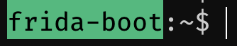

# Frida Boot 👢

Welcome to Frida Boot! A binary instrumentation workshop, using [frida](https://frida.re/), for beginners! While the workshop absolutely has a strong security-related flavour, folks new to the idea of binary instrumentation with either a security or development background may find this useful.

I hope that this workshop gets you excited about using Frida, and accelerates your learning to go from wondering about, to crafting your own spoils! "WTF" to "IDKFA".

## What you will not learn

This workshop will **not** cover the wildly popular mobile application uses of Frida. Instead, the idea is to teach simple, core concepts that can be applied to any runtime (albeit with their nuances) that Frida supports.

## Using this documentation

If you are not already doing so, make sure you browse to the port exposed by the docker container to view this documentation.

Please see [starting](0-getting-started/starting) for information on starting the container.

## Ready for the next step

If you can see the `frida-boot` prompt in your terminal and browse to <http://localhost:9999> then you are ready to continue! Head over to the [Environment](0-getting-started/environment) page!

YES, LET'S GOOOOOOOOO!! [HACKER GO BRRR!](0-getting-started/environment)
